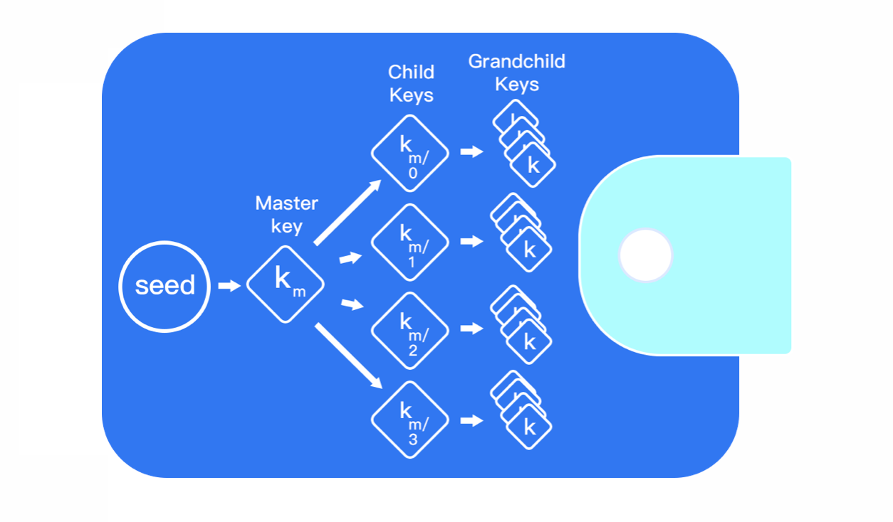
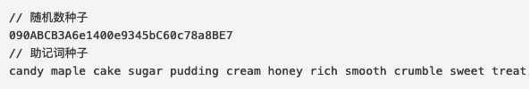
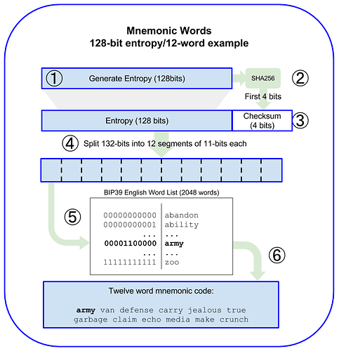

# HD Wallet Develop（一）： 初识钱包

## 什么是加密数字资产钱包

在区块链中，我们的数字资产并没有保存在钱包服务商（例如 imToken）的服务器中，而是「保存」在由私钥推导出来的钱包地址中，放置在区块链网络上。只有拥有地址对应的的私钥，才有转移资产的权力。
因此，数字货币钱包实际上就是一个生成和存储私钥的工具，它并不保存资产，资产全部都是在链上的。
创建钱包地址的关键就是随机生成一把私钥，私钥是一个 32 字节的数字。生成私钥的本质就是在 1 到 2^256 之间选一个数字。因此生成私钥的第一步就是找到一个安全的获取真随机数的办法，来保证获得的随机数是不可预测或不可重复的。
例如：你可以抛硬币 256 次，用纸笔记录正反面并转换为 0 和 1，随机得到的 256 位二进制数字可以作为钱包的私钥。

## 什么是HD钱包（身份钱包）

HD 钱包全称为是分层确定性(Hierarchical Deterministic)钱包的缩写 HD Wallets。是目前广泛使用的虚拟货币钱包标准。HD钱包从单个根种子（root seed）中创建，为128到256位的随机数，任何兼容HD钱包的根种子也可重新创造整个HD钱包，所以拥有HD钱包的根种子就等于拥有了所有密钥，方便存储、导入及导出。

实际上想要理解分层确定性钱包的概念也并没有我们想象的那么困难。它的原理用两句话就可以表达清楚：

首先，要用一个随机数来生成主私钥，这跟其他类型的钱包生成私钥过程没有任何区别。
然后，再用一个确定性的、不可逆的算法，基于主私钥生成任意数量的子私钥。

那为什么要用“确定、不可逆”的算法呢?因为“确定”才能保证从一个主私钥可以生成出全部的子私钥，而“不可逆”则是为了确保不能通过子私钥反推出主私钥。
之所以叫分层确定性钱包是因为私钥的衍生结构是树状结构，父密钥可以衍生一系列子密钥，每个子密钥又可以衍生出一系列孙密钥，以此类推，无限衍生。

分层确定性的概念早在比特币改进提案BIP32提出。根据比特币核心开发者Gregory Maxwell的原始描述和讨论，Pieter Wuille 在2012 年 02月 11日整理完善提交 BIP32 。直到 2016年 6月 15 日 才被合并到进入 Bitcoin Core，目前几乎所有的钱包服务供应商都整合了该协议。BIP 32是 HD 钱包的核心提案，通过种子来生成主私钥，然后派生海量的子私钥和地址，但是种子是一串很长的随机数，不利于记录，所以我们用算法将种子转化为一串助记词 （Mnemonic），方便保存记录，这就是 BIP 39，它扩展了 HD 钱包种子的生成算法。BIP43 对 BIP32 树结构增加了子索引标识 purpose 的扩展.是在 BIP43 和 BIP32 的基础上增加多币种，通过 HD 钱包派生多个地址，可以同时管理主网和测试网的比特币，BIP44 提出了 5 层的路径建议，如下：
m/purpse’/coin_type’/account’/change/address_index
BIP44 的规则使得 HD 钱包非常强大，用户只需要保存一个种子，就能控制所有币种，所有账户的钱包。

## 什么是BIP32,BIP39,BIP44？与HD钱包的关系

BIP （Bitcoin Improvement Proposals），比特币改进建议，BIP32 是第 32 个改进建议。BIP39、BIP44同理就是第39、44项改进建议。

### BIP32

钱包是私钥管理工具，我们可以根据使用需求生成很多私钥。但是你会发现备份和管理私钥是非常麻烦的。最早期的 BTC 钱包就是这样的，所以他还有一个昵称“Just a Bunch Of Keys”（一堆私钥）。为了解决这种麻烦，就有了BIP32提议：根据一个随机数种子通过分层确定性推导的方式得到 N 个私钥，这样保存的时候，只需要保存一个种子就可以了，私钥可以通过种子推导出来，如图：

一句话概括下BIP32就是：为了避免管理一堆私钥的麻烦提出的分层推导方案。

### BIP39

BIP32 能够让我们保存一个随机数种子，而不是一堆密钥。但是对于大部分用户来讲，还是非常不友好，这就促使了BIP39的出现。它使用助记词的方式生成种子，这种情况下用户只要记住助记词，就可以创造出随机种子作为 BIP32 的种子。

（做一个对比，备份助记词比备份随机数种子要方便很多）

整个过程包含两步：1.生成助记词 2.助记词推导出种子
##### 生成助记词
助记词生成的过程是这样的：先生成一个128位随机数，再加上对随机数做的校验4位，得到132位的一个数，然后按每11位做切分，这样就有了12个二进制数，然后用每个数去查BIP39定义的单词表，这样就得到12个助记词，这个过程图示如下：

##### 助记词推导出种子
这个过程使用密钥拉伸（Key stretching）函数，用来增强弱密钥的安全性。（这里就不详细说明了，有兴趣的小伙伴可以自行查找资料）
一句话概括下BIP39就是：通过定义助记词让种子的备份更友好。

### BIP44
通过BIP32分层方式推导出来的秘钥，通常用路径来表示，每个级别之间用斜杠 / 来表示，由主私钥衍生出的私钥起始以“m”打头。
BIP44 则是为这个路径约定了一个规范的含义(也扩展了对多币种的支持)，BIP44 指定了包含 5 个预定义树状层级的结构：

m / purpose’ / coin’ / account’ / change / address_index

m 是固定的，Purpose 也是固定的，值为 44（或者 0x8000002C）

##### Coin type
这个代表的是币种，0 代表比特币，1 代表比特币测试链，60 代表以太坊
[BIP44完整币种列表](https://github.com/satoshilabs/slips/blob/master/slip-0044.md)

##### Account
代表这个币的账户索引，从0开始

##### Change
常量 0 用于外部链，常量 1 用于内部链（也称为更改地址）。外部链用于在钱包外可见的地址（例如，用于接收付款）。内部链用于在钱包外部不可见的地址，用于返回交易变更。 (所以一般使用 0)

##### address_index
这就是地址索引，从 0 开始，代表生成第几个地址，官方建议，每个 account 下的 address_index 不要超过 20

根据 EIP85 提议的讨论以太坊钱包也遵循 BIP44 标准，确定路径是 m/44’/60’/a’/0/n

a 表示帐号，n 是第 n 生成的地址，60 是在 SLIP44 提案中确定的以太坊的编码。所以大家在使用 imToken 导入助记词的时候会看到选择路径的选项，原因就在这里。

一句话概括下 BIP44 就是：给 BIP32 的分层路径定义规范。

### BIP32/39/44 与 HD wallet的关系
HD 钱包（Hierarchical Deterministic Wallets）是在 BIP32 中提出的为了避免管理一堆私钥的麻烦提出的分层推导方案。
而 BIP44 是给 BIP32 的分层增强了路径定义规范，同时增加了对多币种的支持。
BIP39 则通过定义助记词让种子的备份更友好。

## 地址、私钥、公钥、助记词、keystore、密码

##### 私钥
私钥由64位长度的十六进制的字符组成，比如：0xA4356E49C88C8B7AB370AF7D5C0C54F0261AAA006F6BDE09CD4745CF54E0115A，一个账户只有一个私钥且不能修改。通常一个钱包中私钥和公钥是成对出现的，有了私钥，我们就可以通过一定的算法生成公钥，再通过公钥经过一定的算法生成地址，这一过程都是不可逆的。私钥一定要妥善保管，若被泄漏别人可以通过私钥解锁账号转出你的该账号的数字货币。

##### 助记词
私钥是64位长度的十六进制的字符，不利于记录且容易记错，所以用算法将一串随机数转化为了一串12 ~ 24个容易记住的单词，方便保存记录。注意：

    1. 助记词是私钥的另一种表现形式
    2. 助记词可以获取相关联的多个私钥，反过来私钥没法获取助记词。

要弄清楚助记词与私钥的关系，得清楚BIP协议，是Bitcoin Improvement Proposals的缩写，意思是Bitcoin 的改进建议，用于提出 Bitcoin 的新功能或改进措施。BIP协议衍生了很多的版本，主要有BIP32、BIP39、BIP44。

##### 公钥
公钥由私钥通过椭圆曲线生成，变换后是一个65个byte的数组，一般是通过16进制处理后显示。早期比特币开发者不知道可以压缩公钥，压缩后公钥有33个byte数组。当我们拥有一个私钥，就可以算出公钥。而公钥不能计算私钥，这样的模式让数字加密货币获得了一重保障。

##### 地址
大家都知道，公钥跟私钥是成对的，公钥由私钥计算而来，地址则通过公钥进一步计算而来。但注意一点：地址不是公钥。在imToken里创建钱包后，会生成一个以 0x 开头的 42 位 16 进制哈希值字符串，例如:0x7A51Be24D95bb4935dd36eC836CFeDD77aa7b3C5。这串字符就是钱包地址，钱包地址是唯一且不可修改的。钱包地址可以用于接收别人转币，也可以作为转币的凭证。地址可以随便公开，而私钥则万万不能公开哦！

##### 密码
密码不是私钥，它指的是在创建钱包时需要设定一个密码，主要用途有两个，一是转账时候的支付密码，二是用 keystore 导入钱包时的登录密码。

##### keystore
不是私钥，常见于以太坊钱包，一般你创建以太坊钱包后，会让你备份Keystore, 它是一串代码，你可以自己保存为文本或者json格式，日后都可以用任何以太坊钱包打开它。Keystore的本质是加密后的私钥，Keystore必须配合你的钱包密码来使用，所以说，光备份了Keystore但忘记了钱包密码也是然并软了。

##### 上述几者之间的关系
如果把钱包和银行账户作类比，那么：
地址=银行卡号
密码=银行卡密码
私钥=银行卡号+银行卡密码
助记词=银行卡号+银行卡密码
Keystore+密码=银行卡号+银行卡密码
Keystore ≠ 银行卡号

## 代码实现（java版）

 

参考资料：
[Mnemonic Code Converter](https://iancoleman.io/bip39/ "BIP39 BIP44 转换器")  
[什么是身份钱包(HD)?](https://help.tokenpocket.pro/cn/faq/multichain-wallet/hd)   
[bip协议是什么](https://wiki.bsatoshi.com/part-ii/protocol_bip)    
[加密钱包2048个助记词单词表·中英文对照（BIP39协议）](https://mirror.xyz/0x057C4962f54983E5b94DDA114DdfFeF20b1B3920/4JTn8tDSinxGi8nIG8BKWx0--TJZPRfilDwi2WR780g)    
[BIP44完整币种列表](https://github.com/satoshilabs/slips/blob/master/slip-0044.md)    
[区块链HD多链钱包，同一种子管理生成BTC/ETH/EOS钱包助记词、私钥、地址！](https://www.jianshu.com/p/3aefe6399b7d)    
[聊聊钱包、地址、公钥、私钥、密码、助记词、Keystore那些事](https://cloud.tencent.com/developer/news/102227)     